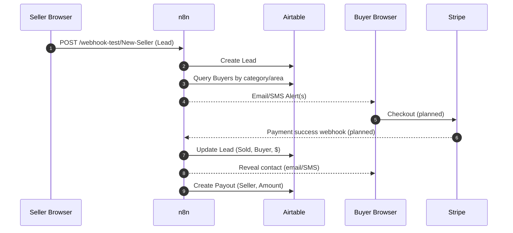

# Tree Lead Exchange — Overflow Leads, Sold Fast

A tiny webapp + automation pipeline where local tree service companies **sell overflow leads** and **buy ready jobs** by ZIP + category.
**Frontend** is served by a small Flask app (Tailwind CDN). **Backend** is a pair of `n8n` webhook workflows that write to **Airtable**.

> **Links**
>
> - Live page: **https://zachbush96.github.io**
> - n8n (workflows): **https://n8n.zach.games**
> - Admin fee: **1% only on successful sale**
> - Refund/replace: **within 48h if contact is unreachable**


---

## Contents

- [How it Works](#how-it-works)
- [Architecture](#architecture)
- [Data Flow](#data-flow)
- [Forms & Payloads](#forms--payloads)
- [Airtable Mapping](#airtable-mapping)
- [n8n Workflows](#n8n-workflows)
- [Matching & Alerts](#matching--alerts)
- [Payments](#payments)
- [Deploy](#deploy)
- [Local Dev](#local-dev)
- [Environment](#environment)
- [Security & Privacy](#security--privacy)
- [FAQ (Product Policies)](#faq-product-policies)
- [Roadmap / TODOs](#roadmap--todos)
- [License](#license)

---

## How it Works

1) **Seller posts overflow** (category, ZIP, ask, private contact).  
2) **n8n stores lead** in Airtable and auto-finds matching buyers.  
3) **Buyers get alerts** (email/SMS) if in category & area.  
4) **First buyer purchases** (exclusive or non-exclusive—configurable).  
5) **n8n reveals contact** to the buyer and **queues payout** for seller.  
6) **Platform takes 1%** admin fee only when a lead sells.

---

## Architecture

- **Frontend:** Single `index.html` (Tailwind v2 CDN), modals submit to `n8n` via hidden-iframe POST (no CORS headaches).
- **Backend:** `n8n` Webhook workflows:
  - `POST /webhook-test/New-Seller` → create **Lead**, match buyers, send alerts.
  - `POST /webhook-test/New-Buyer` → create/update **Business** (role=Buyer) alert preferences.
- **Database:** Airtable base with 4 main tables:
  - **Leads**, **Businesses**, **Interest**, **Payouts** (full schema below).


## Data Flow

Hidden iframe submit: <form target="n8n_sink"> posts directly to n8n; load event on the iframe triggers a uniform “Thanks” modal.

Switching test → prod: In index.html script:

const BUY_LEAD_URL  = 'https://n8n.zach.games/webhook-test/New-Buyer';
const POST_LEAD_URL = 'https://n8n.zach.games/webhook-test/New-Seller';
// Production (uncomment when ready):
// const BUY_LEAD_URL  = 'https://n8n.zach.games/webhook/New-Buyer';
// const POST_LEAD_URL = 'https://n8n.zach.games/webhook/New-Seller';


## Profiles: 
Basic business info (company/email/phone) is cached in localStorage to prefill forms.

# Forms & Payloads
**Buyer: “Get Lead Alerts”**

POST https://n8n.zach.games/webhook-test/New-Buyer

Field	Type	Notes
company	string	Buyer’s business name
email	email	Alerts + account
phone	tel	Optional; needed for SMS
radius	number	Preferred service radius (mi)
zip	string	Primary ZIP
extra_zips	string	Comma separated additional ZIPs
cat[]	checkbox[]	Values: Removal, Trimming, Stump, Crane, Emergency
max_price	number	Max $ per lead
delivery	select	Email only · SMS + Email · SMS only
verified	'yes'	Checkbox attestation

Example (x-www-form-urlencoded)

company=Acorn+Tree+LLC&email=ops@acorn.com&phone=4125551212&radius=15&zip=15237&extra_zips=15210%2C%2015108&cat[]=Removal&cat[]=Trimming&max_price=100&delivery=SMS+%2B+Email&verified=yes

**Seller: “Post Overflow Lead”**

POST https://n8n.zach.games/webhook-test/New-Seller

Field	Type	Notes
company	string	Seller’s business
email	email	Seller contact
city	string	Job city
zip	string	Job ZIP
category	select	Removal · Trimming · Stump · Crane · Emergency
ask	number	Asking price ($)
notes	text	Job details (size, access, hazards, etc.)
customer_contact	string	Private until purchase
exclusive	'yes'	Checkbox (exclusive sale)
optin_replace	'yes'	48h unreachable → replace/refund

Example

company=Summit+Tree+Co&email=crew@summittree.com&city=Pittsburgh&zip=15237&category=Removal&ask=85&notes=Large+oak+in+rear%2C+likely+crane&customer_contact=Jane+H+%28412%29+555-8899&exclusive=yes&optin_replace=yes

## Airtable Mapping

The base contains Payouts, Leads, Businesses, Interest as provided in the schema (generated 2025-08-23). Below is the practical mapping n8n expects to write.

Leads (tblpEmYvELeT6VnYi)

Write on New-Seller:
City/ZIP, Seller (name), Category, Description (from notes), Asking Price ($), Contact Name/Phone/Email (parsed from customer_contact where possible), Status (→ New), Exclusivity, Created (now), Source (e.g., web).

Update on Sale:
Buyer (link), Sold Price ($), Admin Fee 1% ($), Status → Sold.

Businesses (tblvo0GzApyac92pl)

Write on New-Buyer:
Business Name, Email, Phone, Role → Buyer, Service Areas (zip + extra_zips + radius as text), Verified (checkbox if verified=yes), optional Notes.

Write/Upsert on New-Seller:
Ensure seller exists with Role → Seller.

Interest (tblpONDQA1Q3UipOf)

Create on alert send:
Lead (link), Buyer (link), Channel (Email/SMS), Status (Alerted), Created (now).
(Optionally update to Purchased after payment.)

Payouts (tblY18md7rNBu5oJG)

Create after sale:
Seller (link), Lead (link), Amount to Seller ($) (Sold − 1% fee), Status (Queued), Method (e.g. ACH), Tx Ref.

Full field lists & IDs are in the schema block at the end of this README.

## n8n Workflows
**1) New-Seller Webhook**

Trigger: POST /webhook-test/New-Seller
Steps (suggested nodes):

Webhook (POST) → parse form.

Upsert Seller Business (by email).

Create Lead in Airtable.

Find Matching Buyers (see Matching & Alerts).

Create Interest per matched Buyer (Status=Alerted).

Send Email/SMS alerts (respect Buyer delivery).

Respond 200 (minimal HTML/JSON for iframe).

**2) New-Buyer Webhook**

Trigger: POST /webhook-test/New-Buyer
Steps:

Webhook (POST) → parse form.

Upsert Buyer Business.

Persist preferences (categories, zips, radius, max price, delivery).

Respond 200 to trigger Thanks modal.

Planned: Stripe webhooks (checkout.session.completed) to:

Mark Lead sold, set Buyer, Sold Price, fee, and create Payout.

Send contact reveal to Buyer.

## Matching & Alerts

**Current (beta) behavior:**

Match if category overlaps AND ZIP matches (zip equals Lead ZIP or appears in extra_zips).

Enforce Buyer’s max_price (Lead ask ≤ max).

De-duplicate alerts per buyer & lead.

**Optional (enhanced radius):**

If a ZIP geocoding service (e.g., Zipcodeapi or internal table) is configured in n8n, compute distance(primary ZIP ↔ lead ZIP) and match when distance ≤ radius. Store the library/source used in Businesses.Notes for auditability.

## Payments

Fee: 1% platform fee (recorded in Leads → Admin Fee 1% ($) and Payouts → Admin Fee 1% ($) lookup).

Planned: Stripe Checkout (one-time) per lead. After success:

Set Leads.Status=Sold, link Buyer, set Sold Price ($).

Create Payout record with net amount to seller.

Email/SMS buyer with unlocked contact details.

## Environment

Set these (n8n credentials or environment variables as appropriate):

Name	Purpose
AIRTABLE_TOKEN	Airtable PAT
AIRTABLE_BASE_ID	Base ID containing the 4 tables
STRIPE_SECRET_KEY	(Planned) payments
STRIPE_WEBHOOK_SECRET	(Planned) verify events
SMTP_*	Email sending from n8n
TWILIO_*	(Optional) SMS alerts
ZIPCODE_API_KEY	(Optional) ZIP→lat/lng matching
Security & Privacy

PII Handling: Lead contact is stored in Airtable and only revealed post-purchase.

## Roadmap / TODOs

 Send buyer notifications automatically when new leads match criteria (email/SMS, dedupe by lead+buyer).

 Set up Stripe for payment & contact reveal post-success.

 Lead purchase flow: Stripe Checkout session creation, success/cancel pages, and updating Airtable (Lead → Sold, Buyer link, fee calc, Payout record).

 Admin moderation & verification queue: approve/flag leads, verify businesses, audit log of changes.

## Airtable Schema (Provided)

Generated: 2025-08-23T02:39:35.408531Z
Tables: Payouts, Leads, Businesses, Interest
(Field names & types preserved verbatim.)

<details> <summary>Payouts</summary>

Tx Ref (singleLineText)

Seller (multipleRecordLinks)

Amount to Seller ($) (currency)

Status (singleSelect)

Method (singleSelect)

Lead (multipleRecordLinks)

Created (date)

Lead City/ZIP (lookup)

Lead Category (lookup)

Lead Sold Price ($) (lookup)

Admin Fee 1% ($) (lookup)

Payout Summary (aiText)

Potential Issue Flag (aiText)

</details> <details> <summary>Leads</summary>

City/ZIP (singleLineText)

Seller (singleLineText)

Lead ID (number)

Category (singleSelect)

Exclusivity (singleSelect)

Lead Age (singleSelect)

Description (multilineText)

Est. Job Value (singleSelect)

Asking Price ($) (currency)

Contact Name / Phone / Email (singleLineText)

Source (singleLineText)

Status (singleSelect)

Buyer (link)

Sold Price ($) (currency)

Admin Fee 1% ($) (number)

Created (date)

Seller Business Name (lookup)

Buyer Business Name (singleLineText)

Interest Count (count)

Interest (links)

Total Payouts (rollup)

Payouts (links)

Days on Market (formula)

Lead Summary (AI) (aiText)

Lead Category (AI) (aiText)

</details> <details> <summary>Businesses</summary>

Business Name, Website, Contact Name, Email, Phone

Role (singleSelect)

Service Areas (multiline)

Verified (checkbox)

Verification Photos (attachments) / Links (text)

Notes (multiline)

Leads (as Seller/Buyer) + counts, payouts + totals (rollups/formulas)

Verified Status Summary (formula)

Lead Conversion Rate (%) (formula)

Business Category (AI) (aiText)

</details> <details> <summary>Interest</summary>

Name (text)

Lead (link)

Buyer (link)

Channel (singleSelect)

Status (singleSelect)

Notes (multiline)

Created (date)

Lead Status/Category (lookups)

Lead Asking/Sold Price (lookups)

Buyer Role (lookup)

Is Paid? (formula)

Days Since Created (formula)

Interest Summary (AI) / Recommended Next Action (AI)

</details>

## Local Dev

Run the Flask app locally:

```bash
pip install -r requirements.txt
python app.py
```